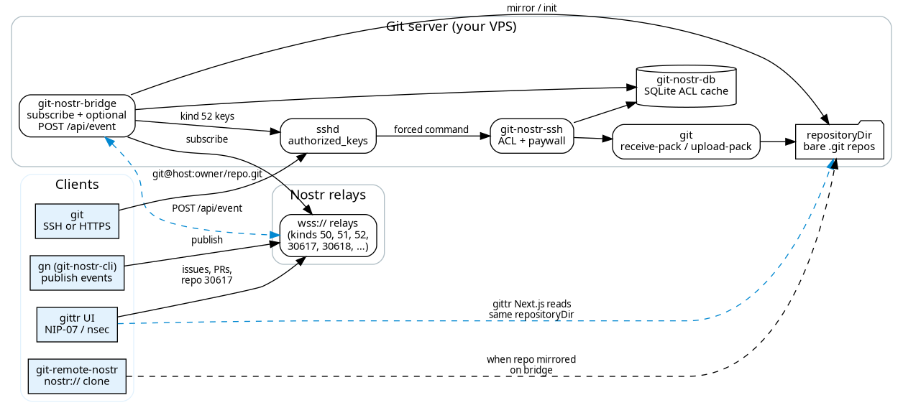

# gitnostr

**Git bridge to Nostr** — [`arbadacarbaYK/gitnostr`](https://github.com/arbadacarbaYK/gitnostr) (this repo) and [`ui/gitnostr/`](https://github.com/arbadacarbaYK/gittr/tree/main/ui/gitnostr) in the gittr monorepo are the **same codebase**.

`git-nostr-bridge` watches Nostr for repo and SSH-key events, keeps **bare git repos on your disk**, and serves **`git push` / `git pull` over SSH or HTTPS**. Repo metadata lives on relays (NIP-34); the bridge is the **git server**. **[gittr.space](https://gittr.space)** is the main forge built on top; you can also run the bridge alone or behind your own UI.

## When gitnostr is the better fit

Use **gitnostr** when you need a **real git server** driven by Nostr—not when you only want a desktop patch client or the **ngit** `nostr://` CLI workflow ([comparison below](#gitnostr-vs-ngit)).

| Use case | Why gitnostr fits |
| --- | --- |
| **Backend for a web forge** | Pair the bridge with any NIP-34 UI. [gittr](https://github.com/arbadacarbaYK/gittr) is the reference: issues, PRs, import, Pages, bounties—all talking to this bridge on `git.gittr.space`. Self-host **gittr + gitnostr** for your community. |
| **Integrate into your own client** | Relays stay the source of truth for discovery; the bridge gives **on-disk repos**, optional HTTP **`/api/event`** (no relay lag for creates), and **tree/file HTTP APIs** for file browsers. See [docs/file-fetch-flow.md](docs/file-fetch-flow.md). |
| **Backup & mirror on your own metal** | Bare repos under `repositoryDir`. Point relays at your instance; use **watch-all** mode (`gitRepoOwners: []`) to mirror every repo you see, or limit to your pubkey(s). `clone` / `source` tags on events pull from GitHub, GitLab, Codeberg, GRASP HTTPS, etc. |
| **Leave centralized git hosting** | Permissions and SSH keys are **Nostr events**; reinstall the bridge on a new VPS and reconnect—same as moving off a censored Git host, without changing day-to-day `git` habits. |
| **Teams that want normal git** | Contributors use **`git clone git@your-host:npub/repo.git`** (or `git-nostr@`). No **ngit** binary required; works with existing CI, hooks, and IDEs. |
| **Public git mirror for the network** | Run a community bridge that mirrors NIP-34 announcements; others clone from your host while metadata stays on relays. |
| **Monetize pushes** | Per-repo **`push_cost_sats`**: Lightning invoice + single-use push grant in SQLite (SSH prints BOLT11 when needed). |
| **Shell-first operators** | Publish repos, keys, and ACL with **`git-nostr-cli` (`gn`)**; the bridge applies changes from relays (and optional HTTP). |
| **Relay outages / flaky networks** | **SQLite** caches permissions and repo metadata so SSH ACL checks still work when relays are slow or down. |

**Usually not the first choice if:** you only need **[ngit](https://ngit.dev)** + **[gitworkshop](https://gitworkshop.dev)** (`nostr://`, GRASP-first, no bridge to operate)—see the table below. You can still publish the **same NIP-34 events**; gitnostr is for hosts and clients that want **SSH/HTTPS bare git on infrastructure you control**.

## gitnostr vs **ngit**

Both use **NIP-34** on relays; different **codebases** and default git workflow. Full forge comparison (gittr vs gitworkshop vs gitplaza): **[gittr README → Web client features](https://github.com/arbadacarbaYK/gittr#web-client-features-comparison)**.

| Layer | **gitnostr** (this repo) | **ngit** |
| --- | --- | --- |
| Role | **Git server:** bridge watches relays → bare repos on disk → **SSH/HTTPS** | **CLI:** `ngit init`, `pr/` branches, **`nostr://`** via [git-remote-nostr](https://github.com/DanConwayDev/ngit-cli) |
| Typical UI | **[gittr](https://gittr.space)** (issues, PRs, bounties, Pages, `/apps`, GitHub import) | **[gitworkshop](https://gitworkshop.dev)** (GRASP mirrors) |
| Day-to-day git | `git@host:<npub>/repo.git` — no ngit binary required | `nostr://` remotes + ngit CLI |
| Own bridge / paywall | **Yes** — `push_cost_sats`, NIP-34 **30617**, HTTP `/api/event`, watch-all mode | GRASP / ngit hosting — not this repo |
| Relay outage | **SQLite** permission cache on bridge | ngit/GRASP stack |

**gittr and ngit share relays, not the same git transport:** gittr runs **gitnostr** on `git.gittr.space`. Issues/PRs and repo announcements can interoperate; day-to-day git on gittr uses **SSH to this bridge**.

| Git access | **With gitnostr + gittr** | **ngit stack** |
| --- | --- | --- |
| SSH / HTTPS to bridge | **Yes** — primary on gittr.space | Via GRASP git hosts, not this bridge |
| Self-host this bridge | **Yes** — clone this repo | ngit/GRASP model |
| **`git-nostr-cli` (`gn`)** | **Yes** — in this tree | Different tool |
| **`nostr://` clone** | **Interop** (gittr publishes `clone` tags; install git-remote-nostr) | **Native** to ngit |

**Bridge components in this repo:** `git-nostr-bridge` · `git-nostr-ssh` · `git-nostr-db` (SQLite) · `git-nostr-cli` (`gn`). Details: [docs/gittr-enhancements.md](docs/gittr-enhancements.md).

## Documentation

- **[SSH & Git Access Guide](SSH_GIT_GUIDE.md)** - Complete guide for using SSH with git-nostr-bridge (cloning, pushing, pulling, permissions)
- **[Bridge enhancements](docs/gittr-enhancements.md)** - HTTP API, watch-all, deduplication (gittr production)
- **[Standalone bridge setup](docs/STANDALONE_BRIDGE_SETUP.md)** - Run without the gittr UI
- **[File fetch flow](docs/file-fetch-flow.md)** - How gittr + bridge serve repo trees
- **[SSH & Git guide (gittr)](https://github.com/arbadacarbaYK/gittr/blob/main/docs/SSH_GIT_GUIDE.md)** — user-facing workflows and examples
- **[CLI push example (gittr)](https://github.com/arbadacarbaYK/gittr/blob/main/docs/CLI_PUSH_EXAMPLE.md)** — HTTP API examples for pushing repositories programmatically

I chose to build on top of the existing git tooling to allow the client side dev tools to remain largely unchanged for daily work (standard git commands work including push and pull)

By storing the config on Nostr your repository configuration can be easily regenerated a new host if your current git provider decides to censor you.

See a demo video here: https://www.youtube.com/watch?v=G-WzlC8XfW4

There is much more to a decentralized github/gitlab experience than just a repository. It would also be advantageous to move pull requests and issues to the Nostr protocol. These should however be treated as separate projects that will hopefully be interopable with this project's approach to repository management.


# How



## git-nostr-db

An sqlite DB is used to cache the latest version of the data needed to perform access control checks to avoid development downtime in case of a relay or the git-nostr-bridge being offline.

### git-nostr-bridge

Connects to a set of relays and:
1. subscribes to the events needed to keep the git-nostr-db up to date
2. creates git repositories as needed
3. updates the ssh authorized_keys file

**DO NOT RUN THE BRIDGE AS YOUR OWN USER YOU WILL LOSE YOUR AUTHORIZED_KEYS FILE**

### git-nostr-ssh

Configured as the command for a nostr users ssh-key in the authorized_keys file.
Whenever a user tries to perform a git operation (push/pull) git-nostr-ssh will perform an access control check.
Repository owners are always treated as `ADMIN` for their own repositories, even if a cached permission row is missing/stale.
If a repository has a configured push paywall (`push_cost_sats > 0`), SSH write operations (`git-receive-pack`) also require a non-expired paid authorization grant in bridge SQLite. If a pending invoice already exists for the payer identity, SSH can print `pending invoice (BOLT11): ...` directly. Each successful push consumes one paid authorization.

### git-nostr-hook

TODO: not implemented yet.

Will enable fine grain branch control e.g. prevent pushing to specific branches or force pushing to a branch.

### git-nostr-cli (gn)

Command line tool with similar options to the github cli that will publish the relevant events using your private key to the configured relays

git-nostr-bridge will then react to these events and update the DB and create any git repos needed.


# Setup Instructions

**Currently this project is Linux only**
**Go version 1.20+ is required**
**It is recommended to use a local private relay for testing. Testing was performed using https://github.com/scsibug/nostr-rs-relay**

**gittr.space:** To install **only** the bridge, clone **`https://github.com/arbadacarbaYK/gitnostr`** (this repo). Inside the gittr monorepo, build from **`ui/gitnostr/`** — same project, kept in sync with GitHub.

## git-nostr-bridge

**These instructions are needed if you intend to host git repositories. If another nostr user has configured a git-nostr-bridge for you then follwo the git-nostr-cli instructions below.**

Create a new user to host the git repositories (This is needed as the bridge will overwrite the authroized_keys file) and switch to the new account

**DO NOT RUN THE BRIDGE AS YOUR OWN USER YOU WILL LOSE YOUR AUTHORIZED_KEYS FILE**

```bash
sudo useradd --create-home git-nostr
sudo su - git-nostr
```

Clone **gitnostr** and build the bridge components

```bash
git clone https://github.com/arbadacarbaYK/gitnostr.git
cd gitnostr
make git-nostr-bridge
```

Start the bridge once to create the empty config files. **DO NOT RUN THE BRIDGE AS YOUR OWN USER YOU WILL LOSE YOUR AUTHORIZED_KEYS FILE**

```bash
./bin/git-nostr-bridge
```

You should get the message `no relays connected`

Edit the config file at `~/.config/git-nostr/git-nostr-bridge.json`. The default file should look like this

```
{
    "repositoryDir": "~/git-nostr-repositories",
    "DbFile": "~/.config/git-nostr/git-nostr-db.sqlite",
    "relays": [],
    "gitRepoOwners": []
}
```

Add your relay of relays to the list of relays. **You should use a local relay for testing until the implementation is finalized.**
Add your public key to the list of gitRepoOwners. **It is recommended to generate a new nostr private/public key pair for testing**

git-nostr-bridge will follow events published by gitRepoOwners and create git repositories for them.

My local testing config looks like this

```
{
    "repositoryDir": "~/git-nostr-repositories",
    "DbFile": "~/.config/git-nostr/git-nostr-db.sqlite",
    "relays": ["ws://localhost:8080"],
    "gitRepoOwners": ["e0e7807d354ea7662412d99856335e1923b0b57b6668575bf320837f6b1816e3"]
}
```

You can now start the bridge again. **DO NOT RUN THE BRIDGE AS YOUR OWN USER YOU WILL LOSE YOUR AUTHORIZED_KEYS FILE**

```bash
./bin/git-nostr-bridge
```

As no events have been published you should see no console output.

Your git-nostr-bridge is now ready for use

## git-nostr-cli (gn)

**Watch out for a conflict with the gn command from https://gn.googlesource.com **

Clone **gitnostr** and build the cli components

```bash
git clone https://github.com/arbadacarbaYK/gitnostr.git
cd gitnostr
make git-nostr-cli
```

run the git-nostr-cli command once to create the default config file

```bash
./bin/gn
```

You should get the message `no relays connected`

Edit the config file at `~/.config/git-nostr/git-nostr-cli.json`. The default file should look like this

```
{
    "relays": [],
    "privateKey": "",
    "gitSshBase": ""
}
```

Add your relay of relays to the list of relays. **You should use a local relay for testing until the implementation is finalized.**
Set your private key. **It is recommended to generate a new nostr private/public key pair for testing**
Set gitSshBase to the ssh user@hostname where a git-nostr-bridge has been installed.

My local testing config looks like this

```
{
    "relays": ["ws://localhost:8080"],
    "privateKey": "...",
    "gitSshBase": "git-str@localhost"
}
```

Publish your ssh-key. you may need to replace id_rsa.pub with the correct public key file

```bash
./bin/gn ssh-key add ~/.ssh/id_rsa.pub
```

Create a test repository and clone it. replace <publickey> with the hex represenation of your public key. If you are using a nip05 capable public key you can use the nip05 identifier instead.

```bash
./bin/gn repo create test
./bin/gn repo clone  <publickey>:test
```

You can set write permission for your repository with the following command. replace <publickey> with the hex represenation of your public key. If you are using a nip05 capable public key you can use the nip05 identifier instead.

```bash
./bin/gn repo permission test <publickey> WRITE
```
