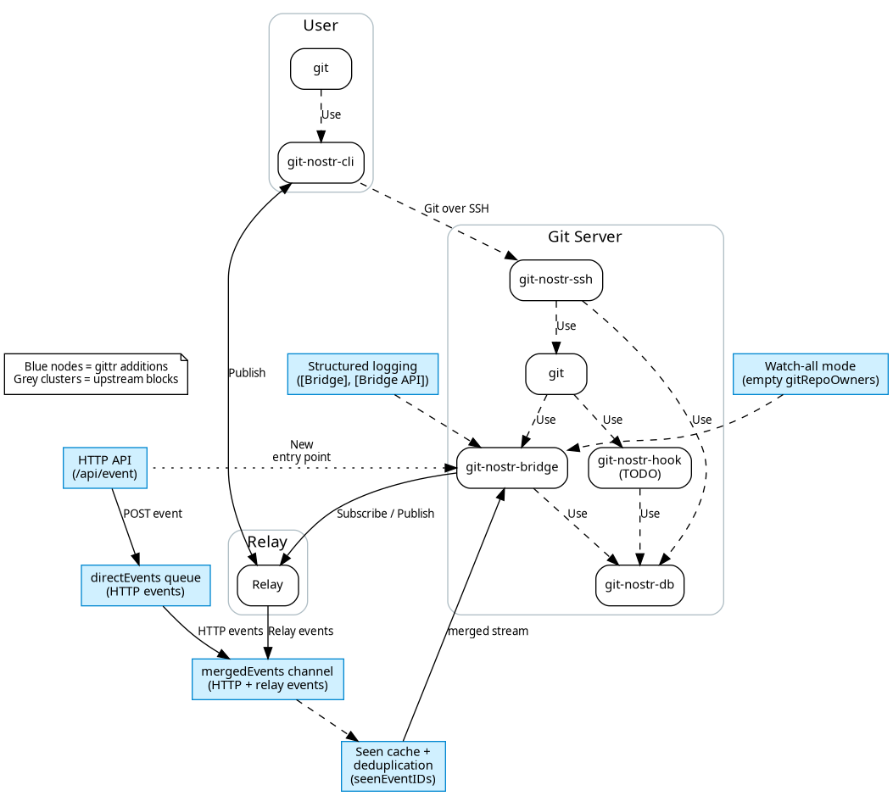

# gittr.space Bridge Enhancements

This repo captures the gittr.space-specific improvements we plan to upstream to @spearson78's
[`gitnostr`](https://github.com/spearson78/gitnostr) project. The goal is to keep the
interface identical while contributing the battle-tested additions we rely on in production.

Blue boxes in the diagram highlight the pieces that do not exist in the upstream bridge yet.

> **Badge legend:** 🆕 marks functionality that exists only in this fork today (pending upstream).

## Feature summary

| Area | What changed | Why it matters |
| ---- | ------------ | -------------- |
| 🆕 HTTP API endpoint (`/api/event`) | Optional listener that accepts POSTed NIP-34 events and injects them into the bridge without waiting for relay propagation. Configured via `BRIDGE_HTTP_PORT` (defaults to `8080`, can be unset to disable). | Lets the UI confirm a push immediately and avoids 1–5s propagation lag while still staying compatible with relays. |
| 🆕 Direct event channel | New `directEvents` queue that merges HTTP submissions with relay subscriptions. | Events published via HTTP and relays are coalesced before processing, so nothing is lost or processed twice. |
| 🆕 Deduplication + "seen" cache | Shared map guarded by mutex ensures that events submitted via HTTP do not retrigger after the relay broadcasts them. | Prevents duplicate repo creation or key updates when events arrive through multiple paths. |
| 🆕 Watch-all mode | If `gitRepoOwners` is empty in the config, the bridge now monitors **all** repos instead of doing nothing. | Enables decentralized hosting: a public bridge can mirror every repo that hits the relays. |
| 🆕 Structured logging | Unified log prefixes (`[Bridge]`, `[Bridge API]`, emojis) make it obvious which subsystem emitted a line. | Helps operators debug mixed HTTP/relay flows quickly. |

### Configuration knobs

- **`BRIDGE_HTTP_PORT` env** – Leave it unset to disable the HTTP listener entirely (pure relay mode,
  identical to upstream). Set it when you want to POST events directly (defaults to `8080`, but any
  port works and you can reverse-proxy it for auth/TLS).
- **`gitRepoOwners` array** – Legacy behavior (non-empty) still scopes subscriptions to specific
  pubkeys. Leaving it empty switches on watch-all mode so public mirrors pick up every repo event.
- **Clone/source URLs** – No gittr-specific values are hard-coded. The bridge simply tries whatever
  clone/source tags the event provides (GitHub, GitLab, Codeberg, GRASP, etc.); HTTPS URLs are
  preferred, and git@/git:// schemes get normalized automatically.

See [`docs/STANDALONE_BRIDGE_SETUP.md`](STANDALONE_BRIDGE_SETUP.md) for a full
configuration reference when deploying the bridge without the gittr UI.

